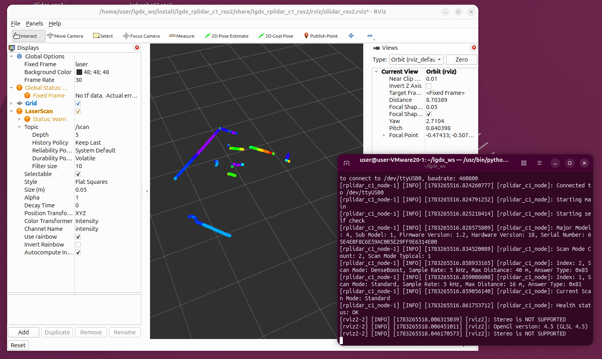

# lgdx_rplidar_c1

## Overview



> [Release Strategy](https://lgdxrobot.uk/handbook/release-strategy/) - Built to Stay Current.<br /> 
[](https://gitlab.com/lgdxrobotics/lgdxrobot2-rplidar-c1/-/commits/main) 
[](https://gitlab.com/lgdxrobotics/lgdxrobot2-rplidar-c1/-/releases) 


A modern ROS 2 Lyrical (or later) wrapper for the RPLIDAR C1, specifically designed for [LGDXRobot2](https://lgdxrobot.uk/lgdxrobot2/). This package is developed from scratch using C++20 and Boost. It supports composable nodes and is able to reconnect to the RPLIDAR if the connection is lost.

## Limitations

While this package may work with other RPLIDAR models by changing the baud rate, there is no guarantee that it will be compatible with them. This package also does not support the following features:

* Changing parameters on the fly: Parameters must be set before the node is started.
* Reading from RPLIDAR over a network: This package is designed to work only with a serial connection.
* DenseBoost scan mode: The RPLIDAR C1 does not support this mode out of the box. Although this package can read data from this mode, the results are not fully tested.

## Installation

### 1.1. APT

> Note: This package is only available on packages.lgdxrobot.uk

```bash
sudo apt install ros-lyrical-lgdx-rplidar-c1
```

### 1.2. Build from source

This package has been tested on Ubuntu 26.04, but it should work on other operating systems, as no system-specific calls are used.

```bash
mkdir -p ~/lgdx_ws/src
cd ~/lgdx_ws/src
git clone https://gitlab.com/lgdxrobotics/lgdxrobot2-rplidar-c1.git
cd ..

# Install build dependencies
rosdep update
rosdep install --from-paths src --ignore-src -y

colcon build --symlink-install
```

### 2. Add UDEV rule

```bash
curl -L -o rplidar.rules https://gitlab.com/lgdxrobotics/lgdxrobot2-rplidar-c1/-/raw/main/udev/rplidar.rules
sudo cp rplidar.rules  /etc/udev/rules.d
sudo service udev reload
sudo service udev restart
```

### 3. Launch

```bash
. install/setup.bash
ros2 launch lgdx_rplidar_c1 view_sllidar_c1_launch.py
```

### Delete UDEV rule (Optional)

If you want to delete the UDEV rule, you can do so by running the following command:

```bash
sudo rm /etc/udev/rules.d/rplidar.rules
sudo service udev reload
sudo service udev restart
```

## Parameters

| Parameter        | Type   | Description                                                       |
| ---------------- | ------ | ----------------------------------------------------------------- |
| serial_port      | string | Specifies the USB port connected to the LiDAR.                    |
| serial_baudrate  | int    | Specifies the baud rate of the USB port connected to the LiDAR.   |
| frame_id         | string | Specifies the frame_id of the LiDAR.                              |
| inverted         | bool   | Specifies whether to invert the scan data.                        |
| angle_compensate | bool   | Specifies whether to enable angle compensation for the scan data. |
| scan_mode        | string | Specifies the scan mode of the LiDAR.                             |

## Published Topics

| Topic            | Type   | Description                                                       |
| ---------------- | ------ | ----------------------------------------------------------------- |
| scan             | LaserScan | Publishes the scan data of the LiDAR.|

## Design

This package relies on Boost.Asio for serial communication. It utilises C++20 coroutines, so there is no blocking when reading from the RPLIDAR. The node consists of the following classes:

* **LidarNode**: The main node class that cooperates with all other classes to initialise the RPLIDAR and read and publish scan data.
* **SerialPort**: A class that handles serial port communication.
* **Config**: A class that handles retrieving the configuration from the RPLIDAR.
* **Scan** (*Strategy class*): A class that starts and reads scan data from the RPLIDAR.
* **ExpressScan** (*Strategy class*): A class that starts and reads express scan data from the RPLIDAR. (Not fully tested.)

Using the Strategy classes, the scanning behaviour can be changed by switching the scan mode.

## Link

* [GitLab](https://gitlab.com/lgdxrobotics/lgdxrobot2-rplidar-c1)
* [GitHub](https://github.com/yukaitung/lgdxrobot2-rplidar-c1)